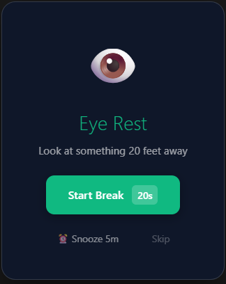
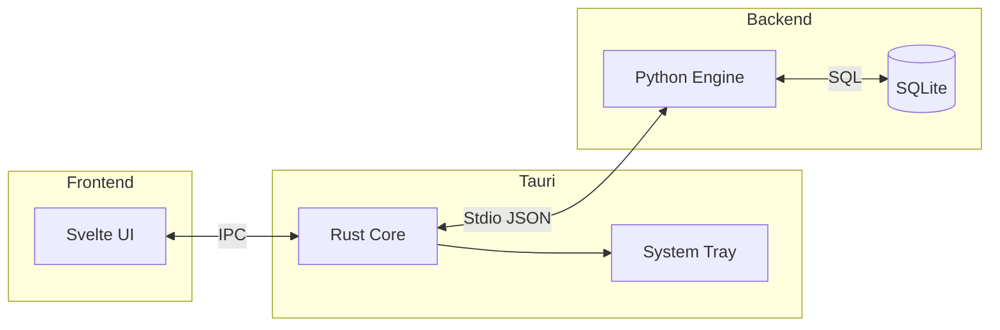

<div align="center">


# 🌿 Aura

### The Intelligent Wellness Companion for Developers

[](https://www.rust-lang.org/)
[](https://tauri.app)
[](https://kit.svelte.dev)
[](https://www.python.org)
[](https://www.typescriptlang.org/)
[](LICENSE)

<p align="center">
  <b>Focus Better · Hydrate Smarter · Work Healthier</b>
</p>

[**Quick Start**](#-quick-start) · [**Features**](#-key-features) · [**Architecture**](#%EF%B8%8F-architecture) · [**FAQ**](#-faq)

</div>

---

<div align="center">

👁️ **Smart Eye Care** &nbsp;•&nbsp; 💧 **Hydration Tracking** &nbsp;•&nbsp; 🧘 **Stretch Reminders** &nbsp;•&nbsp; 📅 **Flexible Scheduling**

</div>

---

## ✨ Key Features

### 👁️ Smart Break Reminders

Personalized break notifications based on your actual work patterns — not arbitrary timers.

- **20-20-20 Rule**: Eye rest reminders every 20 minutes
- **Stretch Breaks**: Movement prompts every 45-60 minutes
- **Active Time Tracking**: Timer pauses when you're idle, counts only real work time

### 💧 Intelligent Hydration

Aura doesn't just nag you to drink water — it **knows** when you've had enough.

- **Goal Tracking**: Logs intake against your daily goal (default: 2000ml)
- **Auto-Silence**: Hydration reminders pause automatically once you hit your goal
- **Quick Logging**: One-click buttons for common amounts (250ml, 500ml)

### 📅 Pro Scheduler

Flexible scheduling that adapts to your life, not the other way around.

- **3 Scheduling Modes**: "Same Every Day", "Weekdays vs. Weekends", or fully "Custom"
- **Automated Actions**: Pause, Resume, or Reset sessions at specific times
- **Smart Warnings**: Get a gentle 1-minute heads-up before any schedule rule triggers

### 🔔 Glassmorphic Notifications

Beautiful, non-intrusive overlay notifications that respect your workflow.

- **Custom Overlay Window**: Transparent, corner-positioned notifications
- **Click-Through Logic**: Never steals focus while you're typing
- **Theme-Matched**: Adapts to break type with smooth animations

---

## 📸 Screenshots

<div align="center">

<table>
<tr>
<td width="50%" align="center">


**Session Hub**  
<sub>Your command center for work sessions</sub>

</td>
<td width="50%" align="center">



**Smart Overlay**  
<sub>Beautiful break notifications</sub>

</td>
</tr>
</table>

</div>

---

## 🏗️ Architecture

Aura uses a hybrid **Sidecar Pattern** combining the best of three languages:

| Layer | Technology | Responsibility |
|:---:|:---|:---|
| **Core** | Rust (Tauri v2) | System Tray, Window Management, OS Integration |
| **UI** | SvelteKit + TypeScript | Reactive Interface, DaisyUI, Glassmorphism Effects |
| **Brain** | Python 3.11 | SQLite Database, ML Data Collection, Scheduling Logic |



---

## 🚀 Quick Start

### Prerequisites

<details>
<summary><b>Required Software</b></summary>

| Software | Version | Link |
|:---|:---:|:---|
| Node.js | 18+ | [nodejs.org](https://nodejs.org/) |
| Rust | Latest | [rust-lang.org](https://www.rust-lang.org/) |
| Python | 3.11 | [python.org](https://www.python.org/) |

</details>

### Installation

**1. Clone the repository**

```bash
git clone https://github.com/hei1sme/aura-app.git
cd aura-app
```

**2. Install dependencies**

```bash
npm install
```

**3. Run in development mode**

```bash
npm run tauri dev
```

---

## 📦 Build for Production

We include robust build scripts that compile the Python engine into a standalone executable.

<details>
<summary><b>Windows (Git Bash)</b></summary>

```bash
./build_release.sh
```

</details>

<details>
<summary><b>Windows (PowerShell)</b></summary>

```powershell
.\build_release.ps1
```

</details>

**Output**: `src-tauri/target/release/bundle/nsis/Aura_1.3.0_x64-setup.exe`

---

## ❓ FAQ

<details>
<summary><b>How does the break timer work?</b></summary>

Aura tracks your **active work time**, not wall-clock time. When you step away from the computer (idle > 3 minutes), the timer pauses automatically. This means you get breaks based on actual screen time.

</details>

<details>
<summary><b>Can I customize break intervals?</b></summary>

Yes! Go to **Settings** to adjust:

- Eye rest interval (default: 20 min)
- Stretch break interval (default: 45 min)  
- Hydration reminder interval (default: 30 min)

</details>

<details>
<summary><b>Does Aura run in the background?</b></summary>

Yes. When you close the main window, Aura minimizes to the **system tray**. Right-click the tray icon to pause, resume, or quit the app.

</details>

---

## 🤝 Contributing

We welcome contributions! Please check the [Issues](https://github.com/hei1sme/aura-app/issues) page.

---

<div align="center">

**[⭐ Star this repo](https://github.com/hei1sme/aura-app/stargazers)** · **[🐛 Report a bug](https://github.com/hei1sme/aura-app/issues)** · **[💬 Discussions](https://github.com/hei1sme/aura-app/discussions)**

---

This project is licensed under the **[MIT License](LICENSE)**.

*✨ Designed for Peace of Mind. 🌿*

<sub>Made with ❤️ using Tauri + SvelteKit + Python</sub>

</div>
