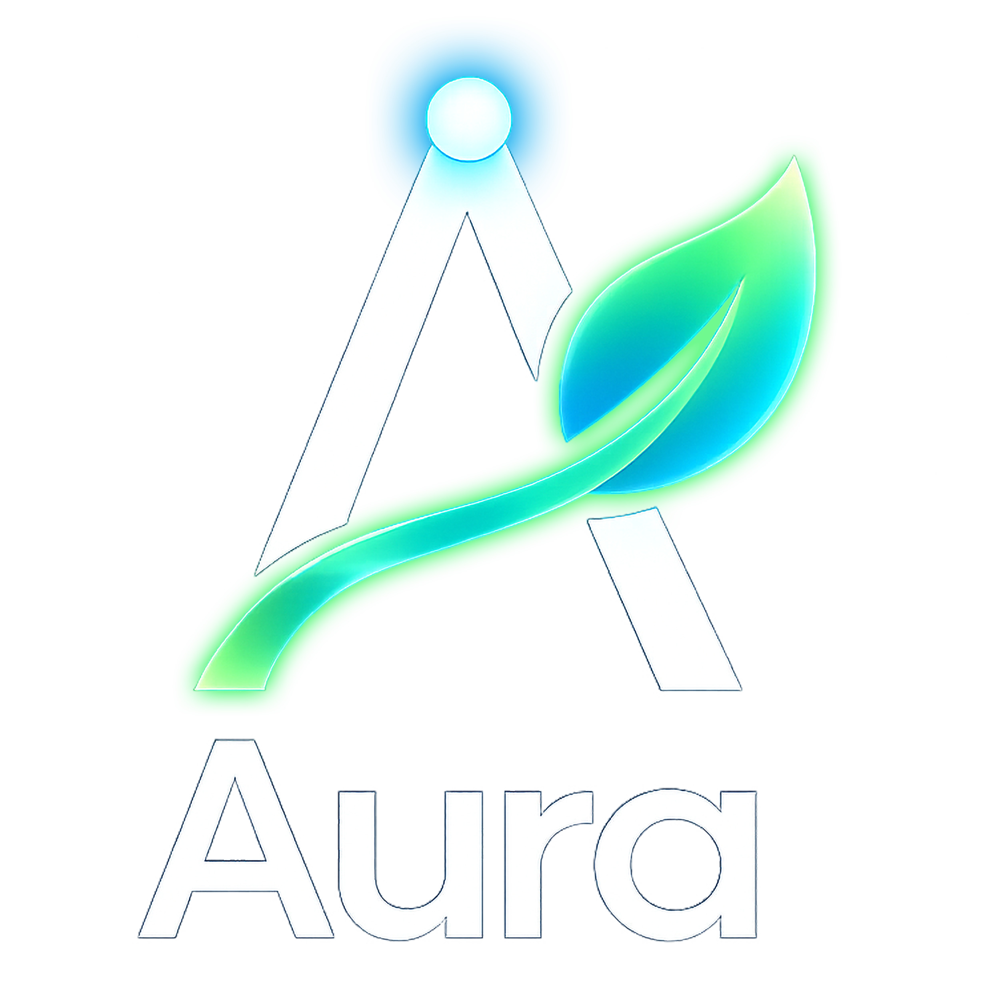
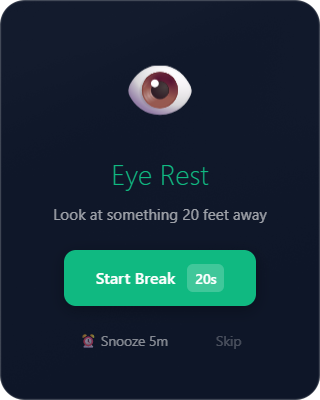
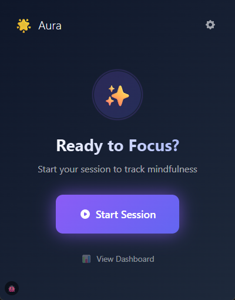
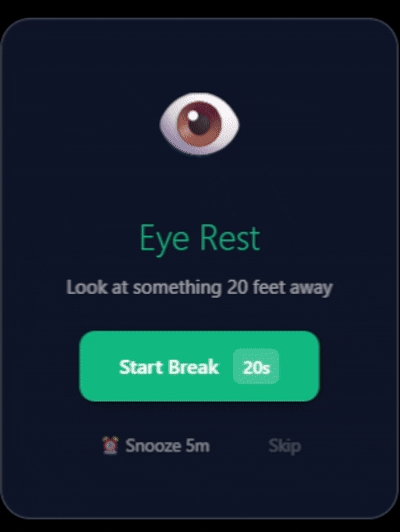
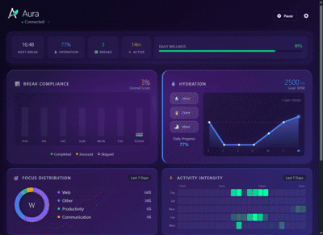
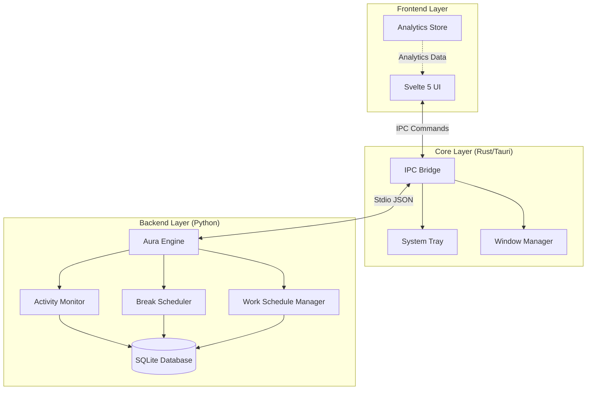

<!-- markdownlint-disable MD033 -->
<div align="center">



### The Intelligent Wellness Companion for Developers

[](https://github.com/hei1sme/aura-app/releases)
[](https://www.rust-lang.org/ )
[](https://tauri.app)
[](https://kit.svelte.dev)
[](https://www.python.org)
[](https://www.typescriptlang.org/)
[](LICENSE)

<p align="center">
  <b>Focus Better · Hydrate Smarter · Work Healthier</b>
</p>

[**Quick Start**](#-quick-start) · [**Features**](#-key-features) · [**Architecture**](#%EF%B8%8F-architecture) · [**FAQ**](#-faq)

</div>

---

<div align="center">

📊 **Enterprise Analytics** &nbsp;•&nbsp; ⚡ **Auto-Updates** &nbsp;•&nbsp; 👁️ **Smart Eye Care** &nbsp;•&nbsp; 💧 **Hydration Tracking** &nbsp;•&nbsp; 🧘 **Stretch Reminders**

</div>

---

## 🎯 What's New

Aura is constantly improving! Check out our latest updates:

- **[v1.5.3](docs/CHANGELOG/CHANGELOG_v1.5.3.md)** - Critical Fixes: Break Notification Loop & Duplicate Sounds
- **[v1.5.2](docs/CHANGELOG/CHANGELOG_v1.5.2.md)** - Bug fixes for version display across all app entry points
- **[v1.5.1](docs/CHANGELOG/CHANGELOG_v1.5.1.md)** - Auto-update on startup, Skip Version feature, Update preferences
- **[v1.5.0](docs/CHANGELOG/CHANGELOG_v1.5.0.md)** - Seamless auto-update system with one-click updates

📋 See [all changelogs](docs/CHANGELOG/) for complete release history.

---

## ✨ Key Features

### 👁️ Smart Break Reminders

Personalized break notifications based on your actual work patterns — not arbitrary timers.

- **20-20-20 Rule**: Eye rest reminders every 20 minutes
- **Stretch Breaks**: Movement prompts every 45-60 minutes (customizable duration)
- **Wall Clock Mode**: Consistent break reminders based on real time (default)
- **Immersive Mode Detection**: Auto-suppresses breaks during fullscreen apps (gaming, presentations)

### 💧 Intelligent Hydration

Aura doesn't just nag you to drink water — it **knows** when you've had enough.

- **Goal Tracking**: Logs intake against your daily goal (customizable, default: 2000ml)
- **Auto-Silence**: Hydration reminders pause automatically once you hit your goal
- **Quick Logging**: One-click buttons for common amounts (100ml, 250ml, 500ml)
- **Weekly Trends**: Visualize your hydration patterns over time

### 📅 Pro Scheduler

Flexible scheduling that adapts to your life, not the other way around.

- **3 Scheduling Modes**: "Same Every Day", "Weekdays vs. Weekends", or fully "Custom"
- **Automated Actions**: Pause, Resume, Reset, Start, or End sessions at specific times
- **Smart Warnings**: Get a gentle 1-minute heads-up before any schedule rule triggers
- **Cross-Restart Persistence**: Your schedule rules survive app restarts

### 🔔 Premium Notifications

Beautiful, non-intrusive overlay notifications that respect your workflow.

<div align="center">



</div>

- **Custom Overlay Window**: Transparent, floating glassmorphism notifications
- **Enhanced Visual Design**: Stronger backdrop blur, multi-layer shadows, refined borders
- **Theme-Matched**: Color-coded by break type (green/orange/blue) with smooth animations
- **No Focus Stealing**: Never interrupts your active typing or workflow

---

## 📸 Screenshots

<div align="center">

<table>
<tr>
<td width="50%" align="center">



**Session Hub**  
<sub>Your command center for work sessions</sub>

</td>
<td width="50%" align="center">


**Analytics Dashboard**  
<sub>Enterprise-level wellness insights</sub>

</td>
</tr>
<tr>
<td width="50%" align="center">



**Smart Overlay**  
<sub>Beautiful break notifications</sub>

</td>
<td width="50%" align="center">



**Settings Interface**  
<sub>Powerful schedule management</sub>

</td>
</tr>
</table>

</div>

---

## 🏗️ Architecture

Aura uses a hybrid **Sidecar Pattern** combining the best of three languages:

<div align="center">

| Layer | Technology | Responsibility |
|:---:|:---|:---|
| **Core** | Rust (Tauri v2) | System Tray, Window Management, OS Integration |
| **UI** | SvelteKit 5 + TypeScript | Reactive Interface, DaisyUI, Glassmorphism Effects |
| **Brain** | Python 3.11 | SQLite Database, Activity Monitoring, Scheduling Logic |

</div>



### Technology Stack

<details>
<summary><b>Frontend</b></summary>

- **Framework**: SvelteKit 2 with Svelte 5 (Runes API)
- **Language**: TypeScript 5.6
- **Styling**: Tailwind CSS 4.1 + DaisyUI 5.5
- **Build Tool**: Vite 6

</details>

<details>
<summary><b>Backend</b></summary>

- **Runtime**: Tauri 2.0 (Rust-based)
- **Engine**: Python 3.11 (PyInstaller for distribution)
- **Database**: SQLite 3
- **IPC**: JSON over stdio

</details>

<details>
<summary><b>Key Features</b></summary>

- Thread-safe state management with Rust mutex
- Real-time activity monitoring (keyboard/mouse)
- Persistent session state across restarts
- Time-based automation with WorkScheduleManager
- ML-ready data collection for future adaptive AI

</details>

---

## 🚀 Quick Start

### Prerequisites

<details>
<summary><b>Required Software</b></summary>

| Software | Version | Link |
|:---|:---:|:---|
| Node.js | 18+ | [nodejs.org](https://nodejs.org/) |
| Rust | Latest | [rust-lang.org](https://www.rust-lang.org/) |
| Python | 3.11 | [python.org](https://www.python.org/) |

</details>

### Installation

**1. Clone the repository**

```bash
git clone https://github.com/hei1sme/aura-app.git
cd aura-app
```

**2. Install dependencies**

```bash
npm install
```

**3. Build Python sidecar** (First time only)

```bash
./rebuild_sidecar.sh    # Git Bash / Linux / macOS
# or
./rebuild_sidecar.ps1   # PowerShell
```

**4. Run in development mode**

```bash
npm run tauri dev
```

---

## 📦 Build for Production

We include robust build scripts that compile the Python engine into a standalone executable.

<details>
<summary><b>Windows (Git Bash)</b></summary>

```bash
./build_release.sh
```

</details>

<details>
<summary><b>Windows (PowerShell)</b></summary>

```powershell
.\build_release.ps1
```

</details>

**Output**: `src-tauri/target/release/bundle/nsis/Aura_1.5.3_x64-setup.exe`

---

## 💎 Advanced Features

### Work Session States

Aura implements a proper finite state machine:

```
IDLE → start_session() → ACTIVE
ACTIVE → pause_session() → PAUSED
PAUSED → resume_session() → ACTIVE
ACTIVE/PAUSED → end_session() → IDLE
```

Each transition is thread-safe and persisted to disk.

### Schedule Automation

Create time-based rules to automate your workflow:

```typescript
// Example: Auto-pause for lunch at 12:00 PM
{
  time: "12:00",
  action: "pause",
  days: ["mon", "tue", "wed", "thu", "fri"],
  enabled: true
}
```

---

## ❓ FAQ

<details>
<summary><b>How does the break timer work?</b></summary>

Aura uses **wall-clock mode** by default — you get consistent break reminders at regular intervals regardless of activity. This ensures predictable, reliable wellness prompts throughout your workday.

</details>

<details>
<summary><b>Can I customize break intervals?</b></summary>

Yes! Go to **Settings** to adjust:

- Eye rest interval (default: 20 min)
- Stretch break interval (default: 45 min)  
- Hydration reminder interval (default: 30 min)
- Daily hydration goal (default: 2000ml)

</details>

<details>
<summary><b>Does Aura run in the background?</b></summary>

Yes. When you close the main window, Aura minimizes to the **system tray**. Right-click the tray icon to access pause, resume, analytics, settings, or quit options.

</details>

<details>
<summary><b>What data does Aura collect?</b></summary>

All data stays **local** on your machine:

- Break logs (completed/skipped/snoozed timestamps)
- Hydration intake records
- Keyboard/mouse activity metrics (for ML training)
- Work session state

No data is sent to any server. Your privacy is paramount.

</details>

<details>
<summary><b>Can I use Aura offline?</b></summary>

Absolutely! Aura is 100% offline. No internet connection required.

</details>

---

## 🤝 Contributing

We welcome contributions! Please check the [Issues](https://github.com/hei1sme/aura-app/issues) page for open tasks.

### Development Setup

1. Fork the repository
2. Create a feature branch (`git checkout -b feature/amazing-feature`)
3. Commit your changes (`git commit -m 'Add amazing feature'`)
4. Push to the branch (`git push origin feature/amazing-feature`)
5. Open a Pull Request

---

## 📋 Changelog

See [CHANGELOG_v1.5.3.md](docs/CHANGELOG/CHANGELOG_v1.5.3.md) for the latest release notes.

---

<div align="center">

**[⭐ Star this repo](https://github.com/hei1sme/aura-app/stargazers)** · **[🐛 Report a bug](https://github.com/hei1sme/aura-app/issues)** · **[💬 Discussions](https://github.com/hei1sme/aura-app/discussions)**

---

This project is licensed under the **[MIT License](LICENSE)**.

*✨ Designed for Peace of Mind. 🌿*

<sub>Made with ❤️ using Tauri + SvelteKit + Python</sub>

---


</div>
