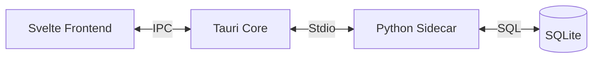

<div align="center">
  
  <h1>✨ Aura</h1>
  <h3>The Intelligent Wellness Companion for Developers</h3>
  
  <p>
    <b>Focus Better. Hydrate Smarter. Work Healthier.</b>
  </p>

  [](package.json)
  [](https://tauri.app)
  [](https://kit.svelte.dev)
  [](https://www.python.org)
  [](LICENSE)
</div>

<br />

> **Aura** is a premium desktop application that blends the performance of **Rust**, the elegance of **SvelteKit**, and the intelligence of **Python** to create the ultimate work-life balance tool.

---

## 🌟 New in v1.3.0

### 💧 Smart Hydration

Aura doesn't just nag you to drink water. It **knows** when you've had enough.

- **Goal Tracking**: Logs your total intake against your daily goal (e.g., 2000ml).
- **Auto-Silence**: Once you hit your goal, hydration reminders automatically pause for the rest of the day.

### 📅 Pro Scheduler

Flexible scheduling that adapts to your life, not the other way around.

- **3 Modes**: "Same Every Day", "Weekdays vs. Weekends", or fully "Custom".
- **Granular Control**: Set specific rules for Lunch, End of Day, or Deep Work blocks.
- **Actions**: Automate Pausing, Resuming, or Resetting sessions.

### 🔔 Glassmorphic Notifications

We ditched the boring system notifications for something better.

- **Custom Overlay**: A beautiful, transparent window that appears in the corner.
- **Non-Intrusive**: Always on top, but click-through logic ensures it never steals focus when you're typing.
- **Smart Warnings**: Get a gentle 1-minute heads-up before any schedule rule triggers.

---

## 📸 Screenshots

<div align="center">
  <!-- Check out the 'assets' folder for these images -->
  
  
</div>

---

## 🛠️ Tech Stack Architecture

Aura uses a hybrid **Sidecar Pattern**:

| Component | Tech | Responsibility |
|-----------|------|----------------|
| **Core** | **Rust (Tauri)** | System Tray, Window Management, OS Integration |
| **UI** | **SvelteKit + TS** | Reactive Interface, DaisyUI Components, Glassmorphism |
| **Brain** | **Python 3.11** | SQLite DB, ML Data Collection, Scheduling Logic |



---

## 🚀 Getting Started

### Prerequisites

* [Node.js](https://nodejs.org/) (v16+)
- [Rust](https://www.rust-lang.org/)
- [Python 3.11](https://www.python.org/)

### Installation

1. **Clone the repository**:

    ```bash
    git clone https://github.com/yourusername/aura.git
    cd aura/aura-app
    ```

2. **Install Frontend Deps**:

    ```bash
    npm install
    ```

3. **Run Development Mode**:

    ```bash
    npm run tauri dev
    ```

## 📦 Build for Production

We include a robust build script that compiles the Python engine into a standalone executable and bundles it with the Tauri app.

**Windows (Git Bash):**

```bash
./build_release.sh
```

**Windows (PowerShell):**

```powershell
.\build_release.ps1
```

The installer will be at: `src-tauri/target/release/bundle/nsis/Aura_1.3.0_x64-setup.exe`

---

## 🤝 Contributing

We welcome contributions! Please check the [Issues](https://github.com/yourusername/aura/issues) page.

<div align="center">
  <br />
  <i>Designed for Peace of Mind. 🌿</i>
</div>
